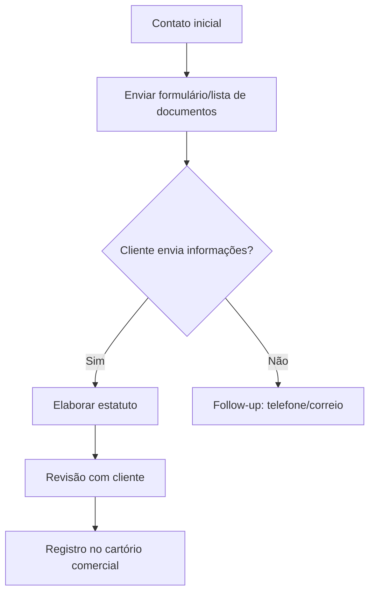

## Processo de Abertura de GmbH e Elaboração de Estatuto  

### Objetivo  
Coletar informações do cliente de forma eficiente para elaborar o estatuto e registrar a GmbH, evitando retrabalho e garantindo profissionalismo.  

---

### Informações Necessárias  
Solicite **todas** as informações abaixo de uma vez:  

#### Dados da Empresa  
1. **Nome da GmbH** (e nome fantasia, se aplicável).  
2. **Endereço comercial** (registrado na Suíça).  
3. **Objeto social** (descrição das atividades).  
4. **Capital social** (valor mínimo: CHF 20.000).  

#### Sócios e Administradores  
1. **Lista de sócios**:  
   - Nome completo.  
   - Número AHV/Arrafal.  
   - Endereço residencial.  
   - Percentual de participação.  
2. **Administradores (Diretores)**:  
   - Nome e dados de contato.  
   - Cópia do passaporte/ID suíço.  

#### Documentos Adicionais  
- **Procuração** (se o cliente não for o responsável pelo registro).  
- **Comprovante de depósito do capital social** (em conta bloqueada).  

---

## Processo de Abertura de GmbH e Elaboração de Estatuto  

### Fluxo do Processo  


### Métodos de Coleta  
#### 1. **Formulário Digital** (Preferencial)  
- Link para enviar ao cliente:  
  ```  
  [Formulário GmbH Online](https://exemplo.com/form-gmbh)  
  ```  

#### 2. **E-mail ou Correio**  
- **Modelo de E-mail**:  
  ```html
  Assunto: Documentos necessários para sua GmbH  

  Prezado(a),  
  Segue a lista de informações para abrir sua GmbH:  
  - Nome completo e AHV/Arrafal.  
  - Endereço comercial.  
  - Cópia do passaporte.  

  Envie por:  
  - E-mail (responda esta mensagem).  
  - Correio para: [Endereço].  

  Atenciosamente,  
  Equipe Jurídica  
  ```  
