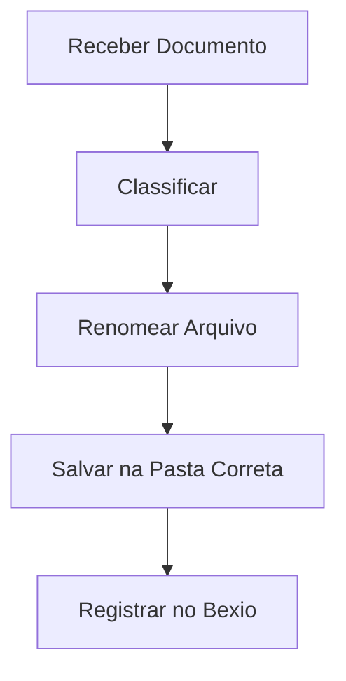

## Processo de Arquivamento Eletrônico de Documentos

### Fluxo do Processo


### Checklist de Arquivos
- **Documentos Obrigatórios**:
  - [ ] Contratos assinados
  - [ ] Procurações
  - [ ] Comprovantes de residência
  - [ ] Cópias de documentos pessoais
  - [ ] Comprovantes fiscais

### Estrutura de Pastas
```
📁 Arquivos_Clientes/
├── 📁 01_Documentos_Pessoais
├── 📁 02_Contratos
├── 📁 03_Comprovantes_Fiscais
├── 📁 04_Comunicações
│   ├── 📁 E-mails
│   └── 📁 WhatsApp
```

### Padrão de Nomenclatura
| Tipo de Documento | Exemplo de Nome |
|-------------------|----------------|
| Contrato | `[CLIENTE]_Contrato_[DATA].pdf` |
| Procuração | `[CLIENTE]_Procuração_[DATA].pdf` |
| Documento Pessoal | `[CLIENTE]_[TIPO_DOC]_[DATA].jpg` |

### Passo a Passo
1. **Recebimento**:
   - Monitorar diariamente:
     - E-mail corporativo
     - Pasta de downloads compartilhada
     - WhatsApp Business

2. **Classificação**:
   ```bash
   # Exemplo de comando para organização inicial
   mv ~/Downloads/*.pdf ~/Arquivos_Clientes/00_Pendentes/
   ```

3. **Renomeação**:
   - Usar o padrão: `[CLIENTE]_[TIPO_DOC]_[ANO-MÊS-DIA].extensão`
   - Ferramenta recomendada: Bulk Rename Utility

4. **Armazenamento**:
   - Salvar na pasta correspondente ao tipo de documento
   - Subir para o Bexio:
     ```bash
     bexio upload --file=documento.pdf --category=financeiro
     ```

5. **Registro**:
   - No Bexio, marcar como:
     ```bash
     [X] Documento arquivado
     [ ] Pendente de validação
     ```

### Modelo de Metadados
```json
{
  "cliente": "Nome do Cliente",
  "tipo_documento": "Procuração",
  "data_recebimento": "2023-11-15",
  "validade": "2024-11-15",
  "armazenamento": "Pasta_02/Subpasta_A"
}
```

### Dicas Importantes
- **Backup Diário**:
  ```bash
  # Comando para backup automatizado
  rsync -avz ~/Arquivos_Clientes/ /mnt/backup/
  ```
- **Verificação Mensal**:
  - Checar documentos sem metadados
  - Validar integridade dos arquivos

### Links Úteis
- [Tutorial Bexio Arquivos](https://help.bexio.com)
- [Modelo de Política de Retenção](/assets/retention_policy.docx)
