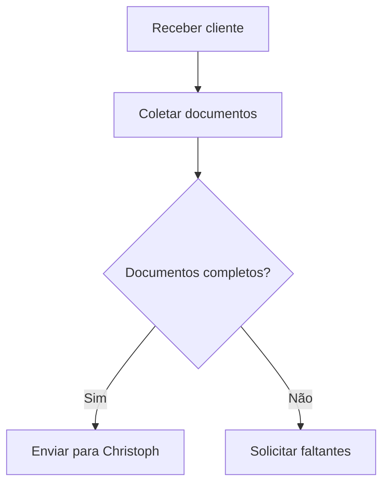

# Processo de Onboarding para Christoph  
**Objetivo**: Padronizar a coleta de documentos necessários para a seguradora Christoph.  

### Documentos Necessários  
- Cópia do documento de identidade (RG/CNH ou passaporte).  
- Número de identificação fiscal (CPF ou equivalente).  
- Comprovante de endereço.  
- Procuração assinada.  

### Fluxo  


### Passos  
1. **Coletar dados**: Usar formulário no Bexio.  
2. **Verificar**:  
   - Todos os documentos estão legíveis?  
   - Assinaturas válidas?  
3. **Enviar**:  
   ```bash
   # Comando para gerar ZIP dos documentos (exemplo)
   zip -r documentos_cliente.zip pasta/
   ```

### Links Úteis  
- [Modelo de Procuração](/assets/modelo-procuracao.docx)  
