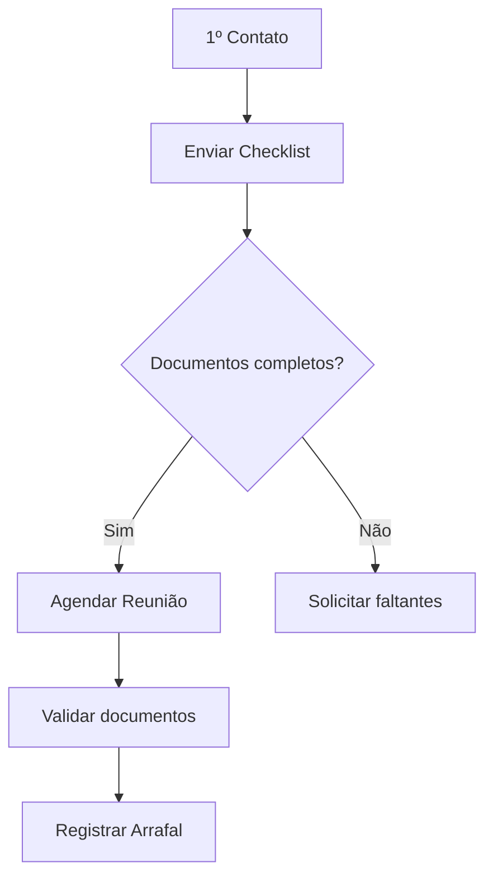

## Processo de Abertura de Sociedades Coletivas e Solo (Sem Capital Mínimo)

### Informações Essenciais
- **Tipos jurídicos atendidos**:
  - Sociedade Coletiva (Kollektivgesellschaft)
  - Sociedade Individual (Einzelunternehmen)
- **Características**:
  - Não exigem capital mínimo
  - Maioria dos clientes da empresa
  - Obrigatório registro no seguro social (Arrafal)

## Processo de Abertura de Sociedades Coletivas/Solo

### Fluxo do Processo


### Checklist Obrigatório
**Dados Pessoais**:
- [ ] Nome completo (como no passaporte)
- [ ] Data de nascimento (DD.MM.AAAA)
- [ ] Número AHV/Arrafal
- [ ] Endereço residencial completo

**Dados da Empresa**:
- [ ] Nome comercial (em idioma local)
- [ ] Endereço da atividade
- [ ] Data de início das operações
- [ ] Descrição das atividades (máx. 3 linhas)

**Documentos**:
- [ ] Cópia do ID suíço/passaporte
- [ ] Procuração assinada (se aplicável)
- [ ] Comprovante de endereço comercial

### Procedimento de Atendimento
1. **Primeiro contato**:
   - Enviar checklist por e-mail/correio
   - Oferecer assistência por telefone se necessário

2. **Pré-reunião**:
   - Preparar:
     - 2 cópias da procuração
     - Formulário de registro Arrafal
     - Checklist impresso

3. **Durante a reunião**:
   - Verificar documentos originais
   - Coletar assinaturas
   - Registrar no sistema:
     ```bash
     # Comando Bexio (exemplo)
     cliente novo --tipo=solo --arrafal=PENDENTE
     ```

### Modelo de Comunicação
**E-mail Inicial**:
```html
Assunto: Documentos para sua sociedade coletiva

Prezado(a),

Necessitamos:
- Nome completo: ________
- Nº AHV/Arrafal: ________
- Cópia do ID (anexo)

Envie por:
✓ E-mail (responda esta mensagem)
✓ Correio: [Endereço]

Prazo: 48h úteis.

Atenciosamente,
Equipe Contábil
```

### Links Úteis
- [Guia oficial registro](https://www.kmu.admin.ch)
- [Modelo de procuração](/assets/procuracoes.docx)
