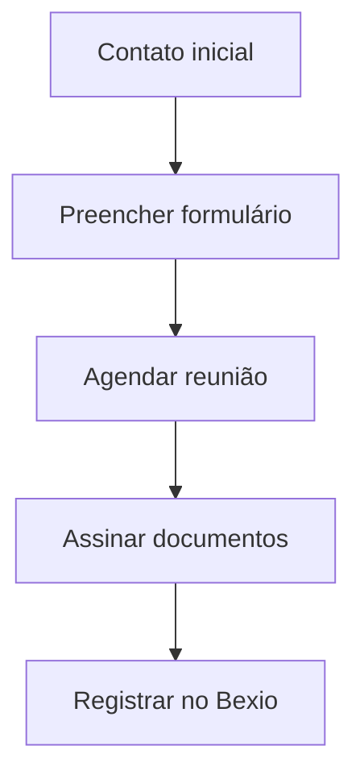

## Processo de Entrada de Novos Clientes  
**Objetivo**: Registrar clientes no sistema Bexio com informações fiscais suíças.  

### Informações Essenciais  
- Nome completo.  
- Número AHV/Arrafal.  
- Endereço residencial e comercial.  
- UID/CNPJ da empresa (se aplicável).  

### Checklist no Bexio  
- [ ] Formulário preenchido.  
- [ ] Documento de identidade anexado.  
- [ ] Procuração assinada.  

### Fluxo  

### Aviso  
Sem o UID/CNPJ, o cliente ficará como "Pendente" no sistema.  
